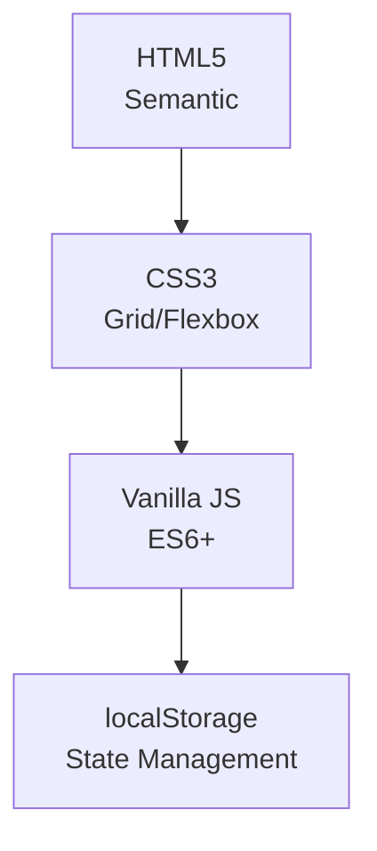

# CALC — Modern Calculator ✨

[](https://shruthijeeva.github.io/CodeAlpha_Calculator/)

A sleek, feature-rich web calculator built with **semantic HTML5**, **modern CSS**, and **vanilla JavaScript**. Focuses on accessibility, responsiveness, and delightful UX.

## ✨ **Key Features**

| Feature | Description |
|---------|-------------|
| 🎨 **Glassmorphism UI** | Modern design with smooth transitions & grid background |
| 🌙 **Dual Themes** | Dark/Light mode (persists via localStorage) |
| ⌨️ **Keyboard-First** | Full keyboard support (numbers, operators, shortcuts) |
| 🧠 **Smart Display** | Dynamic font sizing, expression history, precision handling |
| 📱 **Fully Responsive** | Optimized for mobile, tablet, desktop |
| ⚡ **Advanced Math** | Chain operations, relative %, error handling |

## 🚀 **Get Started**

```bash
git clone https://github.com/shruthijeeva/calc-modern-calculator.git
cd calc-modern-calculator
# Open index.html in any browser
```

## ⌨️ **Keyboard Shortcuts**

| Keys | Action |
|------|--------|
| `0-9` | Digits |
| `+ - * /` | Operators |
| `Enter/=` | Calculate |
| `Backspace` | Delete |
| `Esc/Del` | Clear All |
| `%` | Percentage |

## 🛠️ **Tech Stack**



## 🎨 **Easy Customization**

```css
:root {
  --accent: #9b72e8;  /* Change primary color */
  --glass-bg: rgba(255,255,255,0.1); /* Glass effect */
}
```

## 🤝 **Contributing**
1. Fork → Create feature branch → Commit → PR
---
> **Tech with purpose. Built with passion.** 
